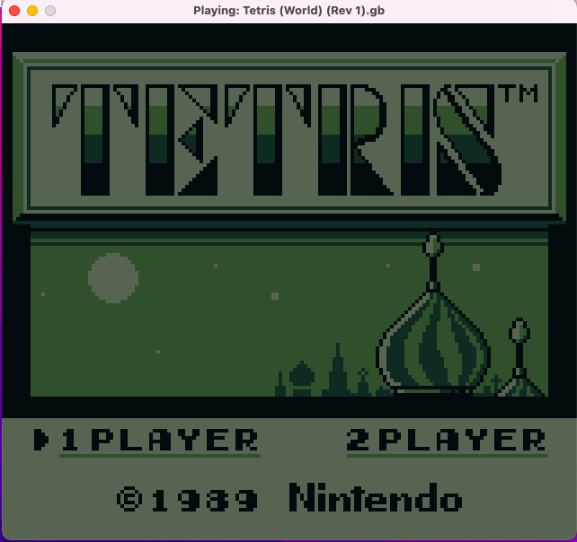
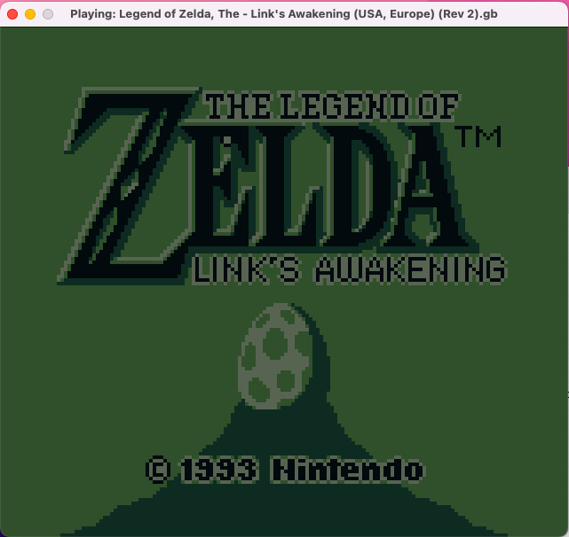
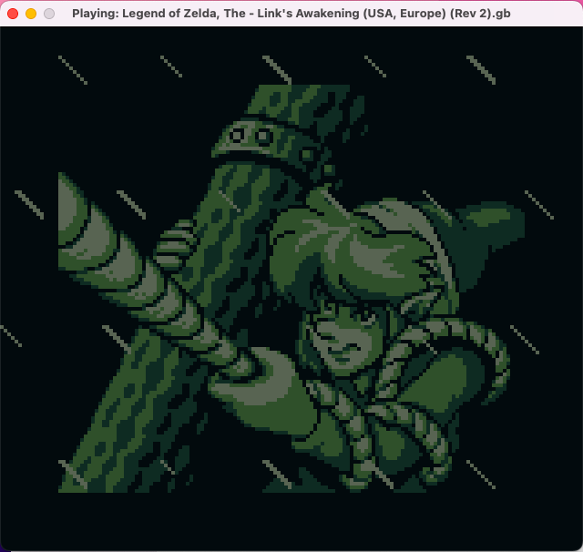
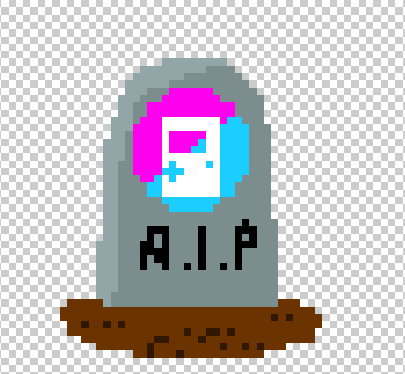

# 🕹️ Custom Lua Game Boy Emulator from Scratch (LÖVE / Love2D) - v1.4

A custom-built, high-performance 8-bit Game Boy (DMG-01) emulator written in Lua using the **LÖVE framework**.

## 📸 Screenshots

  
  
  

*Running "Tetris" and "The Legend of Zelda: Link's Awakening" smoothly with full audio, input, and save state support.*

## 🚀 What's New in v1.4 (Stability Update)
* **🐛 Super Mario Land Fix:** Fixed a critical bug causing a freeze, making the game fully playable.
* **🎵 Audio Refinement:** Improved audio core, reducing noise in the sound engine.
* **⚡ General Fixes:** Minor improvements to CPU timings and rendering stability.

## 🌟 Core Features
* **💾 Save States:** Instant save/load (`F5` / `F6`).
* **🎵 APU Implementation:** Channel-based sound synthesis.
* **🧠 Mapper Support:** MBC1, MBC2, MBC3, MBC5 compatibility.
* **🎮 Input Handling:** Accurate Joypad matrix with Gamepad support.

## 🛠️ Installation & Controls
1. Install [LÖVE](https://love2d.org).
2. Run with `love .` in the project directory.

**Controls:** Arrows (Move), Z (A), X (B), Space (Start), Shift (Select).

---

## 🛑 Project Status & Maintenance

**This project is archived and no longer maintained.**

Due to personal time constraints, I am no longer able to roll out updates, fix bugs, or actively develop this emulator. The project has successfully fulfilled its educational goals and will remain available in read-only mode as a reference for the community.

If you are interested in improving this codebase, fixing remaining issues, or expanding its features, you are highly encouraged to **Fork** this repository and continue development in your own space. 

Thank you to everyone who checked out the project, tested it, or supported its development!

